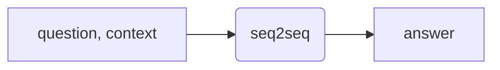
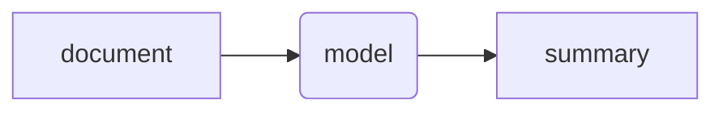

#deepLearning #cs #neuralNetwork 

# Transformer

## 01 Seq2seq

Transformer 是一个 sequence-to-sequence model，我们一般简写作 seq2seq。seq2seq 的意思是指，输入是一个 sequence，输出也是一个 sequence，并且两个 sequence 的长度不一定，这里的长度不一定的意思是指：1. 输入的长度不一定；2. 输出的长度由机器自己决定；3. 输入和输出的长度并不存在必然关系。

比较典型的 seq2seq 的例子有语音识别、文字翻译、语音翻译等，还有例如 text-to-speech (文字转语音) 的 model 也是一种 seq2seq，甚至是聊天机器人 chatbot，也是 seq2seq。

其实，seq2seq 在 NLP 方面的应用是很广泛的，很多你认为可能跟 seq2seq 无关的任务也可以转换成 seq2seq。NLP 的本质其实是 question answering (QA)，而只要能想象成 QA，就基本上都能用 seq2seq 解决。

Seq2seq 还可以用于解决 multi-label classification，multi-label 是将一个东西分到多个类别里的任务，并且一个东西可能属于不止一个类别，而 seq2seq 的输出长度是机器自己决定的，也就是机器觉得有几个输出就几个输出，也就是机器觉得这个东西属于哪几个类别那就是哪几个类别，所以 seq2seq 也可以硬解 multi-label classification。

除此以外，就连图像识别问题也可以用 seq2seq，但是这里就不展开了。至少至此，我们已经知道了 seq2seq 是一个强大的 model，那么它究竟是怎么做到的，接下来我们就要开始研究了。
## 02 Mechanism

Seq2seq 主要由两大部分组成 —— encoder 和 decoder。

Encoder 负责接收和处理数据，然后将处理过的数据交给 decoder，decoder 则根据数据决定输出结果。接下来，我们就来具体来看看 encoder 和 decoder 的结构。
### 2.1 Encoder

简单来说，encoder 要做的事情就是将接收的一排向量，转换成另一排向量，这一个过程可以用很多种方法来完成，例如 RNN 和 CNN，而 transformer 采用的是 [[Self-attention|self-attention]]，大名鼎鼎的注意力机制也就是从 transformer 中诞生的。

Encoder 内部其实是一个一个 block (块)，每个 block 都接收一排向量，输出一排向量，而且每个 block 的工作也大致都是相同的，其实都是对 input 做 self-attention，然后将 output1 丢进一个全连接网络，得到 output2，这个就是一个 block 的输出。所以 encoder 的结构大致如下：

实际上，transformer 中的 self-attention 是比我们之前讲的 self-attention 更复杂的。在 transformer 中，self-attention 的 output 还要再加上最开始的 input，才算得到最终的 output，这种架构被称为 **residual connection (残差连接)**，这个技术旨在解决深度神经网络训练过程中的梯度消失和梯度爆炸等问题。然后，还要对得到的 residule 做 layer normalization，方法是：求 residule 整个序列的均值 $m$ 和标准差 $\sigma$，然后做标准化：

$$
x_i^\prime=\frac{x_i-m}{\sigma}
$$

这样得到的序列才是全连接网络的输入，但是还没完，全连接网络的输出仍要再进行一次 residule connection，即将输入和输出相加，然后同样要对 residule 进行 layer normalization，这样才能得到 block 的输出。

现在我们来看一下 *Attention is all you need* 这篇论文中所画的 encoder 的结构：

首先，input 进行 embedding 之后，作为输入进行 multi-head attention，考虑到有些时候序列可能是有序的，所以图中还画出了 positional encoding 的环节，这项技术在 self-attention 的笔记中有提到。Attention 之后，得到的输出要先于最初的输入进行相加 (add)，然后进行 layer normalization，这就是上图中淡黄色框的含义。再网上要进行 feed forward，其实就是把上一步得到的结果喂给全连接网络，然后对得到的结果再进行一次 Add & Norm。这就是上图的含义。

### 2.2 Decoder

Decoder 的架构其实分为两种 —— autoregressive (AT) 和 non-autoregressive (NAT)，接下来要将的 autoprogressive 是比较常见的架构，我们将以语音辨识为例进行讲解。

#### 2.2.1 Autoprogressive

##### decoder 的工作流程

假设我们在处理语音辨识的问题，现在，语音已经通过 encoder 转换成了一个序列，decoder 要接收这个序列，然后输出对应的文字。我们暂且不提 decoder 是如何接收 encoder 的输出的，我们假设 decoder 能接收到 encoder 的输出，然后来解释一下 decoder 的工作流程。

首先，我们得给 decoder 一个特殊的 token，我们称之为 BOS (begin of sentence)，接下来简称 BEGIN。当 decoder 接收到这个 token 时，它就开始输出，它的输出应该是一个 one-hot vector，也就是一个独热编码的向量，其大小等同于词汇的大小，以中文为例，可能就是所有中文字的数量。当然你可能会说这有点太大了，那实际上，我们可能只取常见的几千个中文字，生僻字我们不去管。

这个 vector 中的数字就是每个对应位置上的中文字的可能性，它们的总和是 1，由对 decoder 的输出做 softmax 之后得到，最终 decoder 生成汉字就是取其中可能性最大的那个。

总而言之，我们现在得到了第一个汉字，假设这个汉字是“机”，那么下一步，我们要把这个 decoder 生成的汉字加入到 decoder 的输入中，也就是说，现在的 decoder 的输入不只有 BEGIN 了，还有了“机”，于是重复上面的步骤，得到第二个输出“器”，周而复始……最终得到完整的输出“机器学习”。在这个过程中，decoder 当然也有读入 encoder 的输出，但是这一部分我们先不讲。总结上面的过程，我们可以说，其实 decoder 就是将自己前一刻的输出当作输入，进一步得到下一时刻的输出。这里就诞生了一个问题：要是 decoder 自己预测的内容出错了怎么办？会不会造成 error propagation，也就是一步错步步错？当然是有可能的，但是这个问题我们之后再谈，我们先暂且当作没这回事。

##### decoder 和 encoder 的结构对比

现在我们来看看论文中画的 decoder 的结构，decoder 看上去很复杂，但如果我们将其与 encoder 的结构进行对比，似乎能发现一些相似之处。

你可能会发现，如果我们把 decoder 中间那一块盖起来，encoder 的结构好像就跟 decoder 差不了多少了，无非是 decoder 的输出最后还要经过一个线性层，再经过 softmax 激活，来输出可能性罢了。唯一的不同可能就是 decoder 中，一开始的 attention 是 masked multi-head attention，那这个 masked 是什么意思？

##### masked self-attention

在我们原来所讲的 self-attention 中，输出的 $b_1$ 是考虑了 $a_1\sim a_n$ 所有的资讯之后得到的 $a_1$ 的资讯，$b_2\sim b_n$ 皆是如此；而在 masked self-attention 中，输出不再能考虑后面的资讯，意思是，$b_1$ 只是考虑了 $a_1$ 后，$a_1$ 的资讯；$b_2$ 是考虑了 $a_1, a_2$ 之后，$a_2$ 的资讯；$b_3$ 是考虑了 $a_1, a_2, a_3$ 之后，$a_3$ 的资讯……只有 $b_n$ 是考虑了整个输入后，输出的资讯。这就是 masked self-attention。

至于为什么要用 masked，其实原因很简单。我们之前也解释了，decoder 会拿自己的输出作为输入，输出是从左到右依次产生的，输入肯定也只能从左到右依次输入，所以就出现了这样只能读左边，而不能读右边的 masked self-attention 机制。

##### 何时终止输出

之前说过，transformer 的输出长度是机器自己决定的，也就是由 decoder 决定的，但到目前为止，我们都还没有讨论过，decoder 到底是如何决定输出长度的，它是怎么知道什么时候该停止输出的。就像前面举的例子，在 decoder 输出完“机器学习”之后，万一它又把 BEGIN+“机器学习”作为输入，输出了个“惯”字怎么办？

对这一点的处理是很巧妙的，要解决这个问题，我们还得再准备一个特殊的 token，叫作 END。就像 BEGIN 是开始的标志，END 就是终止的标志，并且，END 存储在 encoder 的输出 one-hot vector 里，也就是说，one-hot vector 的长度是 vocabulary 的长度再加上 END。如果根据 encoder 的计算，发现输出的 one-hot vector 中，END 的概率是最高的，那就意味着输出该结束了。通过这种方式，encoder 就能自行决定何时终止输出。

#### 2.2.2 Non-autoregressive

接下来我们简短地介绍一下另一种 decoder 的架构 —— non-autoregressive，简称 NAT。

##### AT vs NAT

AT 的运作方式是，先将开始标志 BEGIN 作为输入传入，得到一个输出，随后将自己的输出作为输入再传进来，再得到下一个输出，然后再将下一个输出继续传进来，得到下下个输出，循环往复，直到输出 END；而 NAT 则不一样，它一开始就接收多个 BEGIN，于是得到多个输出，也就是一个完整的句子，然后就结束了。

##### 何时终止输出

那么问题就来了，既然我们一开始都不知道输出的长度，那我们要怎么知道该给 decoder 多少个 BEGIN？

解决这个问题的方法有很多，一种方法就是准备一个 classifier，将 encoder 的输出先丢给 classifier，由 classifier 决定输出的长度，于是就丢对应长度的 BEGIN。

另一种可能的处理方法是，不管输出的长度，直接丢给 decoder 尽可能大的 BEGIN 数目，然后看看 decoder 的输出中，哪里出现了 END 标志，我们只取 END 前面的内容，END 后面的输出就不管了。

##### NAT 的优势

NAT 的优势在于，它的运算是平行的，而不像 AT 那样，要预测下一个输出，就必须等前一个输出完成，所以 NAT 的速度应该是比 AT 要快的；另外，它的输出长度是可控的，这就允许我们人为地去控制输出。

NAT 是一个热门的研究话题，它的性能比 AT 要好，也比 AT 的可控性高，但一个严重的问题是，NAT 的准确率是远不及 AT 的。NAT 要想赶上 AT 的准确率，往往需要很多的秘诀才能做到，而 AT 可能只要随便跑跑就能达到比较高的准确率。所以，如何让 NAT 赶上 AT 的准确率，是目前一个大热门。不过这里就不细讲了，毕竟这是一个大坑，有兴趣的话可以自己去了解。

### 2.3 Encoder-Decoder

接下来，我们就要来看看之前说先暂且遮起来的那一块了。

##### cross attention

图中被框起来的那一部分叫作 cross attention，它是连接 encoder 和 decoder 的桥梁。你可以看到，从 encoder 引出了两个箭头连接到了 multi-head attention，除此以外还有一个箭头是从 decoder 的上一层引出的，那这个模组到底是怎么运作的？我们继续以语音辨识的例子进行阐述。

首先，encoder 读进一个向量 $a^1,a^2,a^3$，并且输出一个等长的向量 $b^1, b^2, b^3$，用同样的方法，得到对应的 $k^1,k^2,k^3$ 和 $v^1,v^2,v^3$；同时，decoder 读进一个 BEGIN，进行 masked self-attention，由于是 attention，所以输出也肯定是一个和 BEGIN 等长的向量，接下来，将这个输出乘上一个矩阵，进行 transform，得到 $q$；然后用 $q$ 与 $k^1, k^2, k^3$ 去分别计算，得到 $\alpha^1,\alpha^2,\alpha^3$，然后再分别乘上 $v^1,v^2,v^3$，将加权的结果加起来，得到 $v$，这个 $v$ 就是接下来的全连接网络的输入。在这个过程中，$\alpha, k, v$ 都来自 encoder，而 $q$ 来自 decoder，所以这个过程就叫做 **cross attention**。

如果说现在 decoder 已经产生了一个输出“机”，那么接下来的操作也是一样的，将“机”作为输入传进去，进行 masked self-attention，然后得到 $q^\prime$，去做相同的运算得到 $v^\prime$，再丢进全连接网络得到下一个输出，如此往复……

### 2.4 Conclusion

Transformer 的工作流程已经讲完了，为了深入理解这些过程，而不是仅仅停留于表面的数学运算，我们还得从实例中剖析这个过程。Ecoder 所做的工作其实是对 input 进行提炼，方法就是 self-attention；而 decoder 则是将 encoder 提炼后的数据，以及一个开始标志 BEGIN 作为输入，开始生成结果，并且每得到一个 output，就将这个结果加入到自己的 input 中，做 masked self-attention，以此不断得到新的 output，直到 decoder 输出 END 为止。

下面我们以机器翻译为例，假设我们需要机器翻译“我喜欢你”这句话，那么 transfomer 做的第一件事是，将这句话输入到 encoder 当中，通过 self-attention 获取语义编码，这里以 $c$ 标识，这里的 $c$ 是一个向量，其中包括了 $c_1,c_2,...$ 等等，每一个汉字就对应一个 $c$。

$$
c=\operatorname{Encoder}(\text{"我喜欢你"})
$$

然后，decoder 将该语义编码与一个 token，也就是上面说的 BEGIN 作为输入，得到第一个单词的输出：

$$
\text{I}=\operatorname{Decoder}(c_1,BEGIN)
$$

然后将这个单词作为输入，再进行一次输出：

$$
\operatorname{love}=\operatorname{Decoder}(c_2,BEGIN,I)
$$

重复上面的过程，直到输出 END：

$$
\begin{aligned}
&\text{you} = \operatorname{Decoder}(c_3,BEGIN,I,love)\\\\
&\text{END}=\operatorname{Decoder}(c_4,BEGIN,I,love,you)
\end{aligned}
$$

于是最后得到的翻译结果：$\text{I love you.}$

## 03 Training

现在我们已经把 transformer 的内部运作方式给讲完了，下一步，就是讲讲 transformer 的训练。

我们知道，机器学习的目标就是不断降低 loss。而 seq2seq 这件事，似乎就是在做分类，最后的输出是从所有汉字中选择一个最可能的，所以衡量 seq2seq 的 loss，可以使用和 classifier 类似的方法。在 transformer 中，我们继续以语音辨识为例，decoder 输出的每一个汉字都与正确答案之间有一个 cross entropy，模型优化的目标就是，使所有输出与正确答案之间的 cross entropy 的总和最小。

### 3.1 Copy mechanism

有些时候，输出的序列会和输入的序列有重合的部分，例如下面这个 chatbot 的例子：

再比如说文献摘要，让机器来给一篇文献写摘要，摘要中肯定会有与正文内容相同的部分。

我们当然是希望机器能够从输入的内容中，直接把这些重合的部分提取出来，而不是自己合成，那这就需要借助 copy mechanism，让机器能够直接从输入中把部分内容 copy 过来。这样的模型当然是存在的，最早的具有复制能力的模型是 copy network，后来还有论文 [Incorporating Copy Mechanism in Sequence-to-Sequence Learning]( https://arxiv.org/abs/1603.06393 )也做过这个，如果感兴趣可以自己去了解。

### 3.2 Guided attention

机器观察输入，对输入做 attention 的顺序是不固定的，这是机器自己学习的结果，自己学习就会导致问题。例如在 TTS (Text to Speech) 的任务中，有些时候，机器居然会漏字。如果是一般的 chatbot 或者 summarization 问题，那么漏一两个字可能也没什么关系，但在 TTS 中，漏字是非常严重的问题。这个时候，我们可以用 guided attention 来教给机器一个固定的顺序来处理输入。

例如说，在 TTS 中，读入一段文字之后，机器应该从左到右依次做 attention，这样才是正确解决问题的方法。但如果机器颠三倒四，先看后面，再看前面，最后看中间，那显然有些事情就做错了，需要我们人工纠正。

所以 guided attention 就是要求机器的 attention 遵循一个固定的法则，这个法则肯定是我们事先就知道了这个问题的处理方式才得出的，guided attention 也一般只适用于那些有固定解法的问题。

一些关于 guided attention 的关键词汇：<u>monotonic attention</u>、<u>location-aware attention</u>。如果感兴趣可以自行搜索。

### 3.3 Beam search

继续以语音辨识为例，假设现在的 vocabulary 中只有 A 和 B 两个字，那么我们可以构建出一棵树，每次 decoder 都只面对 A 和 B 两种选择。那么根据原则，在每一个节点处，decoder 会选择分数最高的那个，一直到叶子节点。这种搜索方法叫作 greedy decoding，因为它每次都挑分数最高的。

但是有时候，选择当前分数最高的，未必能选出一条总分数最高的 path，如下图所示：

虽然一开始 B 的分数比 A 低，但是我们可以看到，之后路径上的节点的分数明显比 A 之后路径上节点分数要高，所以总体而言，一开始选分数较低的那个，反而能得到一条更好的 path。但是我们要怎么做才能选出这条 path 呢？一种方法是 dfs，即全部走一遍，但显然这种方法不显示，毕竟中文里的汉字有几千个，不可能用 dfs 来搜索。

那么还有一种方法就是 beam search，它可以找出一条相对好的，但也不是很精准的 path。那么这个算法到底有没有用呢？有趣的是，它有时候有效，有时候就没什么作用。那什么时候有用呢？根据研究，当一个问题有一个比较明确的解时，beam search 就会比较有用；但当一个问题需要发挥机器自己的想象力来完成的时候，beam search 就比较没用。如果感兴趣，可以自行了解。